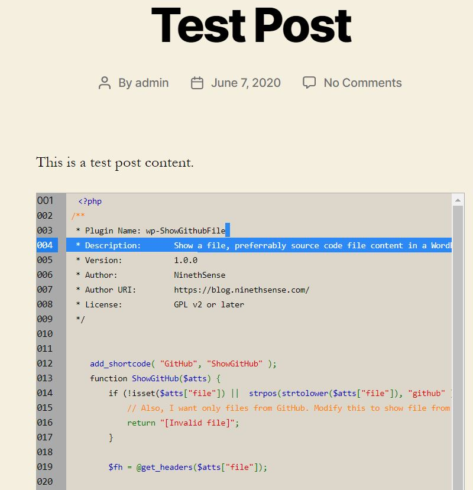
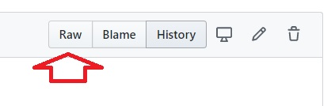

## Plugin Name: wp-ShowGithubFile

/**
 * Plugin Name: wp-ShowGithubFile
 * Description:       Show a file, preferably source code file content in a WordPress blog post or page
 * Version:           1.0.0
 * Author:            NinethSense
 * Author URI:        https://blog.ninethsense.com/
 * License:           GPL v2 or later
 
 */
 
 
 

 ## Description:
 This is a very minimal show file contents WordPress plugin. PHP's building syntax highlight feature is used to highlight any source code. 
 
 ## Installation
1. Download the file *wp-ShowGithubFile.php* and upload to your */wp-content/plugins* folder
2. Login to your Wordpress admin (/wp-admin) and go to *Plugins* section
3. "Activate" the plugin
 
 ## Usage:
 **[GitHub file="GitHub raw file path" [style='css style']]**

 Use only GitHub's raw file URL.
 

 
## Examples: 
 
 **[GitHub file="https://raw.githubusercontent.com/ninethsense/code-share/master/PortPing/PortPing.php"]**

 **[GitHub file="https://raw.githubusercontent.com/ninethsense/code-share/master/PortPing/PortPing.php" style='max-height:400px']**

## Disclaimer
 Use this at your risk. This project has not been tested thoroughly, and has very minimal features.